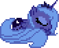
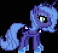
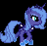
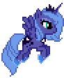

  

<table align="center">
  <tr>
    <td align="center">
      👩‍💻 Estudante de <b>Engenharia de Computação</b> na UFC Sobral 
      🎮 Desenvolvendo projetos no <b>Hub de Games</b> e <b>PET-Saúde Digital</b> 
      🎨 Entusiasta de desenvolvimento nativo, UI/UX e pixel art!
    </td>
  </tr>
</table>

  

  

  

 

  

 

<table align="center">
  <tr>
    <td align="center">
      📱 Foco em <b>Desenvolvimento Android Nativo</b> usando Kotlin e Jetpack Compose. 
      📊 Explorando análise de dados e machine learning para a área da saúde. 
      ⚙️ Curto a área de embarcados, mexendo com ESP32 e microcontroladores. 
      👾 Nas horas vagas, você me encontra fazendo pixel art no Aseprite, testando receitas de brownie ou jogando no meu emulador retrô.
    </td>
  </tr>
</table>

  

  

  

 

  

 

  <b>📱 Mobile & Software</b>  
  
  
  
  

 

  <b>🎨 Design & Prototipagem</b>  
  
  
  
  

 

  

  

  

 

  

 

  

  

  

  

 

  
    
  <i>Sinta-se à vontade para mandar um "olá" para falarmos sobre Android, pixel art ou trocar ideias de videogame hehe! (◕‿◕✿)</i>
    
  

