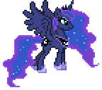

 

👩‍💻 Estudante de Engenharia de Computação na UFC Sobral
🎮 Desenvolvendo projetos no Hub de Games e PET-Saúde Digital
🎨 Entusiasta de desenvolvimento nativo, UI/UX e pixel art!

##  Sobre mim
- 📱 Foco em **Desenvolvimento Android Nativo** usando Kotlin e Jetpack Compose.
- 📊 Explorando análise de dados e machine learning para a área da saúde.
- ⚙️ Curto a área de embarcados, mexendo com ESP32 e microcontroladores.
- 👾 Nas horas vagas, você me encontra fazendo pixel art no Aseprite, testando receitas de brownie ou jogando no meu emulador retrô.

## 🛠️ Minhas Ferramentas

### Mobile & Software

### Design & Prototipagem

## 📈 Meus Status

  

## 📫 Como me encontrar 

